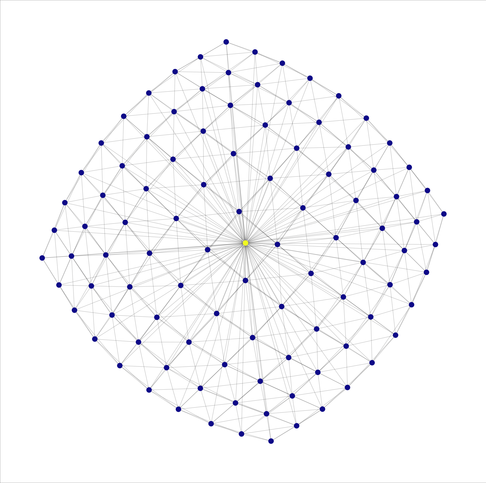
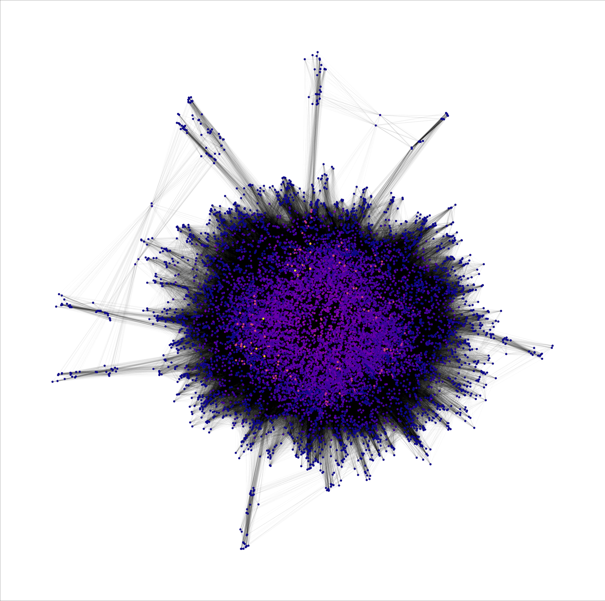
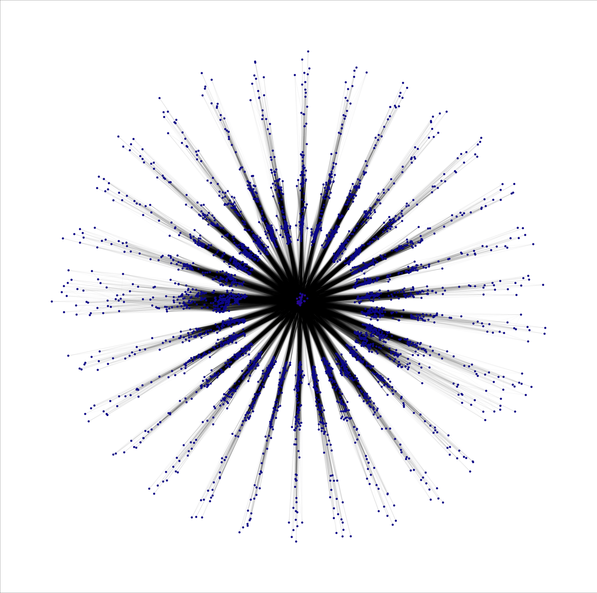
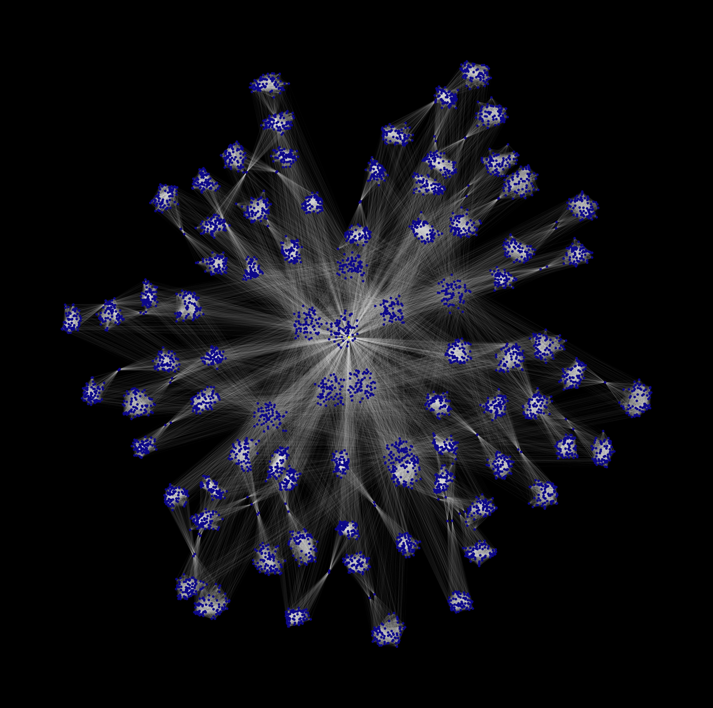
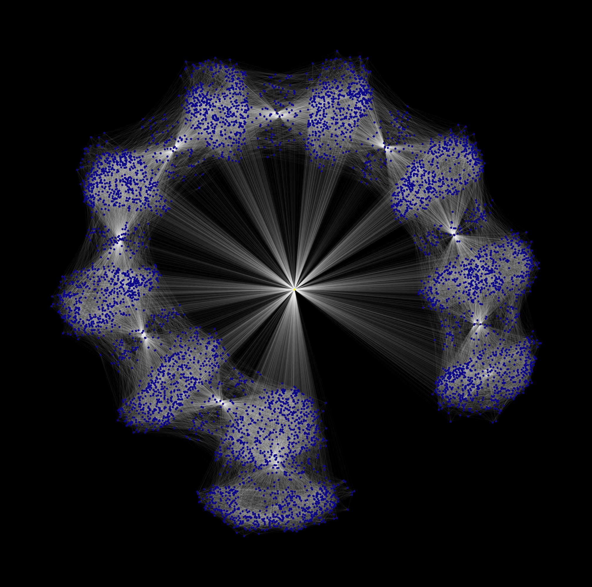
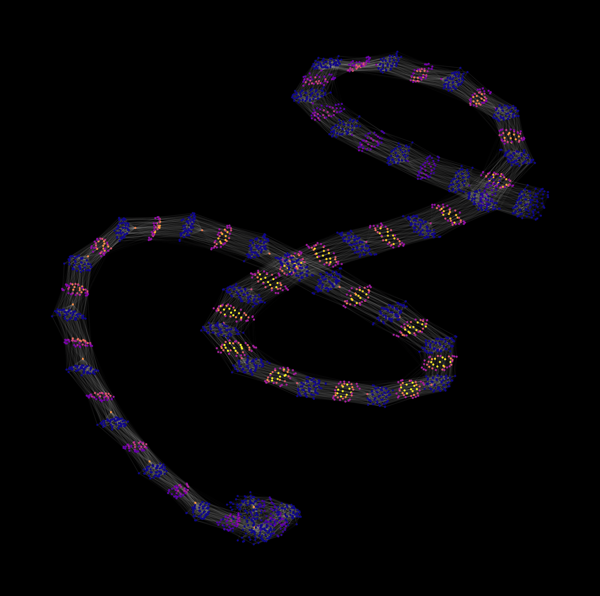

# exvis

exvis **vis**ualizes MIP instances based on their **ex**pressions (variables and constraints) as a graph.

## Installation

```bash
pip install exvis
```

## Usage

```bash
exvis --input data/example/enlight_hard.mps.gz
```

For further options, see `exvis --help`.

## Preview

Shown here are visualizations of instances from the Hans Mittelmann benchmark set.

| | |
|:-------------------------:|:-------------------------:|
| enlight_hard |  eva1aprime5x5opt |
| neos-1171737 |  neos-1324574 |
| mine-90-10 |  peg-solitaire-a3 |
